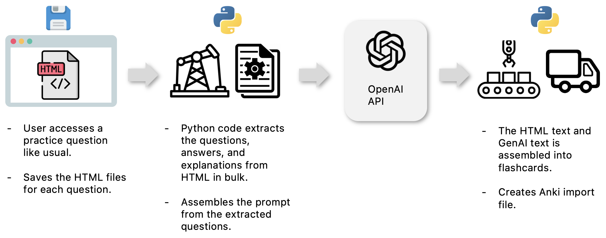

# HEART – HTML‐to‐Anki Enhanced Human Explanation & Reasoning Tool
Medical students must maximize their time engaging with [active recall](https://pmc.ncbi.nlm.nih.gov/articles/PMC4031794/) of large volumes of clinical information during their third-year clerkships and for the clerkships' [shelf exams](https://www.lecturio.com/blog/what-are-shelf-exams-and-how-do-i-study-for-them/#elementor-toc__heading-anchor-0). Nonetheless, many students (I among them) with their full clinical schedules struggle to allocate time to assemble highly informative [Anki](https://apps.ankiweb.net/) flashcard decks (a popular digital flashcard app among medical students), edit pre-made decks to suit their learning needs, followed by active studying in the evening. Frustrated by my own late-night copy-paste marathons at the beginning of 2024, I built a Python CLI (HEART) that leverages the OpenAI API to transform full UWorld vignettes into AI-enhanced Anki cards—complete with clinical reasoning breakdowns, distractor insights, and study-optimized prompts—with a single command.

## Value and Advantages
### Maximize UWorld's Utility
- Adding Anki's spaced repetition and knowledge-gap prioritization algorithm to *whole* UWorld questions (clinical vignettes) and their corresponding answer explanations.
- Replaces pre-made Anki flashcard desks that contain isolated facts with no explained relationships to other clinical information.

### Additional insights *not* Provided by UWorld
- Breakdowns of the clinical vignettes that describe how learners should apply their clinical reasoning as they work through the question.
- Expand on why incorrect answer choices are wrong and would have been correct in other clinical scenarios.
- Discussion on first/second/third-line treatments and diagnostic tests.

### Time Reclamation for Active Learning
- I reduced the Anki deck assembly time of UWorld questions from 1-2 hours to *less than 5 minutes.* (40 questions at a time.)
- Eliminates repetitive copy-pasting from learning resources and the need to format text. Hitting `cmd+c` and `cmd+v` is not active learning.
- The app generates an import file that is compatible with Anki, so you can easily import the generated flashcards in bulk into your Anki deck.

## How It Works
<table>
  <tr>
    <td align="center">
       
    </td>
  </tr>
</table>

1. The user accesses a UWorld question and its answer explanation in thier browser like usual and saves the HTML page to their computer simply by using the keyboard shortcut `cmd+s` on MacOS or `ctrl+s` on Windows.
2. HEART reads the HTML files in the HEART `html_dump` directory and extracts the question, multiple choice answers, and answer explanation text in bulk. Each HTML file yields one flashcard.
3. The question, multiple choice options, and correct answer is then sent to the OpenAI API, which generates a breakdown of the clinical vignette, distractor insights, and study-optimized prompts.
4. Once the OpenAI API returns the generated text, HEART formats the assmebles the flashcard with the question on the "front-side" and the original explanations and generated text on the "back-side" of the card.
5. Then a single Anki import file is generated in the `import_files` directory that contains all of the processed questions and their corresponding generated text. The user can then import the file into Anki using the Anki desktop app.

## Tools and Techniques Used
### Automated HTML Parsing & Batch Extraction  
- **[BeautifulSoup4](https://pypi.org/project/beautifulsoup4/) for Robust Scraping**  
   - Reliably crawls saved UWorld HTML dumps to extract question stems, answer choices and explanations—eliminating error-prone manual copy-paste and ensuring 100% consistency across hundreds of cards.
   - It scales effortlessly as question banks grow.
- Leverages the `markdown` library to convert LLM outputs into clean, Anki-compatible HTML—preserving headings, lists, and emphasis without manual tweaks.  

### AI-Driven Clinical Reasoning Enrichment  
- **[OpenAI API](https://platform.openai.com/docs/overview) Integration**  
  Sends each question + answers to the OpenAI endpoint and retrieves targeted “Vignette Analysis,” “Differential Diagnosis Logic” and “Pathophysiology Review,” transforming raw Q&A into high-value learning narratives.  
 
### User-Centered CLI & Workflow Reliability  
- Implements a lightweight status thread that prints “Generating text…” during API calls—keeping users informed and during longer processing runs. This is followed by printing a truncated preview of the front and back of the generated flashcard.

## Usage
1. After cloning the repository, create a conda environment using the `myenv.yml` file. Activate the environment using the command `conda activate `.
2. Assign your OpenAI API key to the `OPENAI_API_KEY` environment variable in your `.env` file at the root of the project directory. Note: this is separate from having a ChatGPT Plus account and one needs to add funds to their [OpenAI Platform](https://platform.openai.com/) account to use the API.
3. While in the root of the project directory, run the app using the command `python app.py` in your terminal.

## Limitations and Disclaimers
This code is provided at no charge and users are responsible for verifying the accuracy of the information provided by the app. UWorld is not affiliated with this project. UWorld copyrighted material accessed by this app is used under the [fair use doctrine](https://copyrightalliance.org/faqs/what-is-fair-use/) for the purposes of individual education for those with a paid personal license to UWorld study material. This project is not designed (nor has the capabilities) to distribute copywrited material. Copywrited material is not stored in this repository.

# Contact
Morris A. Aguilar, Ph.D. 
morrisglr@proton.me 
@morrisglr.bsky.social